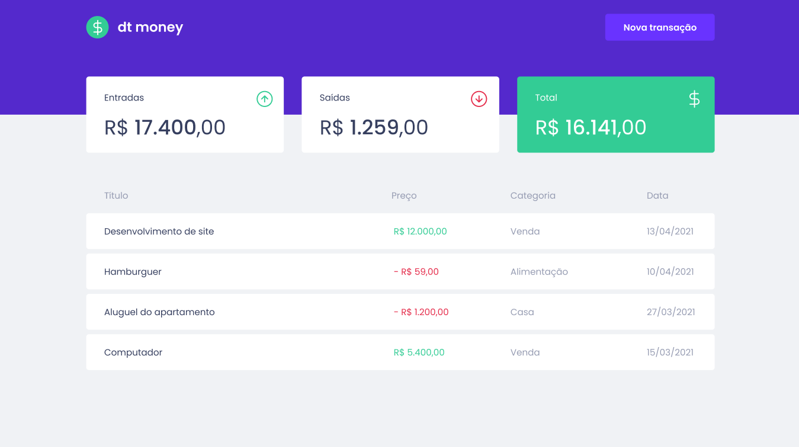

<h1 align="center">dt money</h1>
<h2 align="center">Rocketseat - Ignite - ReactJS</h2>

<h3 align="center">Chapter #2</h3>

  <a href="#-Project">Project</a>&nbsp;&nbsp;&nbsp;|&nbsp;&nbsp;&nbsp;
  <a href="#hammer_and_wrench-Features">Features</a>&nbsp;&nbsp;&nbsp;|&nbsp;&nbsp;&nbsp;
  <a href="#-Technologies">Technologies</a>&nbsp;&nbsp;&nbsp;|&nbsp;&nbsp;&nbsp;
  <a href="#-Layout">Layout</a>&nbsp;&nbsp;&nbsp;|&nbsp;&nbsp;&nbsp;
  <a href="#-How-to-execute">How to execute</a>&nbsp;&nbsp;&nbsp;|&nbsp;&nbsp;&nbsp;
  <a href="#-Licence">Licence</a>

  

## 💻 Project

dt money is a app to manage your money. This is the second project of ReactJS track of Ignite course from [Rocketseat](https://rocketseat.com.br/).

## :hammer_and_wrench: Features

- [ ] List transactions
- [ ] Add transactions

## ✨ Technologies

This project was developed with the technologies above:

- [React](https://reactjs.org)
- [TypeScript](https://www.typescriptlang.org)
- [Babel](https://babeljs.io)
- [Webpack](https://webpack.js.org)
- [Jest](https://jestjs.io)
- [Styled Components](https://styled-components.com)
- [MirageJS](https://miragejs.com)

## 🔖 Layout

You can view the project layout through [this link](https://www.figma.com/file/DZx1UwdWzm3ivFQAo3rkq4/dtmoney-Ignite). You must have a [Figma](http://figma.com) account to access it.

## 🚀 How to execute

- Clone the repository
- Install de dependencies with `yarn`
- Run the application with `yarn start`
- Access [`localhost:3000`](http://localhost:3000) in your browser

## 📄 Licence

This project is under the MIT license. See the [LICENSE](./LICENSE) file for more details.

---

Made with ♥ by Jonathan Alba Videira and Rocketseat
